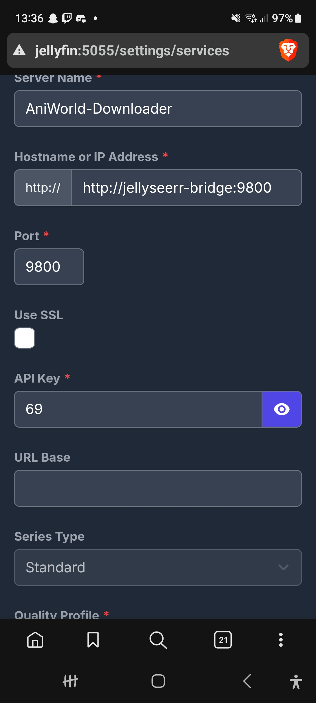

# Jellyseerr to AniWorld-Downloader Bridge

This project is a Python FastAPI application that emulates a Sonarr server. Its purpose is to connect to Jellyseerr and trigger downloads via the [AniWorld-Downloader](https://github.com/phoenixthrush/AniWorld-Downloader) when an anime request is approved.

By acting as a Sonarr server, it allows for a seamless, native integration with Jellyseerr.

## How It Works

1.  **Jellyseerr Request**: When a user requests an anime in Jellyseerr and it gets approved, Jellyseerr sends the request to this bridge, treating it as a Sonarr server.
2.  **Bridge Emulates Sonarr**: The bridge exposes the necessary Sonarr API endpoints (`/api/v3/rootfolder`, `/api/v3/qualityprofile`, `/api/v3/series`) that Jellyseerr needs to communicate.
3.  **Process Request**: The bridge receives the request on its `/api/v3/series` endpoint, extracts the anime title and requested seasons, and validates the request.
4.  **Trigger Download**: It then uses the AniWorld-Downloader's API to find the anime, fetch the correct episode URLs, and start the download.

## Prerequisites

-   **AniWorld-Downloader**: You must have a running instance of the AniWorld-Downloader (the `next` branch is recommended) with its web authentication enabled.
-   **Jellyseerr**: A running instance of Jellyseerr.
-   **Docker & Docker Compose**: Docker must be installed to run this bridge.
-   **Shared Docker Network**: For the services to communicate, both AniWorld-Downloader and this bridge must be part of the same Docker network (e.g., `media-network`).

## Installation

1.  **Clone the Repository**
    ```bash
    git clone <repository-url>
    cd jellyseerr-bridge
    ```

2.  **Configure Environment Variables**
    Create a `.env` file by copying the example file:
    ```bash
    cp .env.example .env
    ```
    Open the `.env` file and fill in the required details:
    -   `DOWNLOADER_URL`: The full URL to your AniWorld-Downloader instance (e.g., `http://aniworld-downloader:8080`).
    -   `DOWNLOADER_USER`: Your AniWorld-Downloader username.
    -   `DOWNLOADER_PASS`: Your AniWorld-Downloader password.
    -   `BRIDGE_API_KEY`: A secret API key that you create. You will need this for the Jellyseerr setup.

3.  **Run with Docker Compose**
    Start the bridge service in detached mode:
    ```bash
    docker-compose up -d
    ```

## Jellyseerr Configuration

Instead of a webhook, you will now add the bridge as a Sonarr server directly in Jellyseerr.

1.  In Jellyseerr, go to **Settings > Services**.
2.  Click **Add Sonarr Server**.
3.  Fill in the server details:
    -   **Server Name**: `AniWorld Bridge` (or any name you prefer).
    -   **Hostname or IP Address**: `jellyseerr-bridge` (**Important**: Do NOT include `http://` or the port here. Just the service name from your `docker-compose.yml`).
    -   **Port**: `9800`
    -   **API Key**: The same secret API key you set for `BRIDGE_API_KEY` in your `.env` file.
    -   **SSL**: Leave this unchecked unless you have configured a reverse proxy with SSL.

    **Example Configuration:**
    

4.  Click **Test**. Jellyseerr will make a few API calls to the bridge. If everything is configured correctly, you will see a "Test Successful" message.
5.  Save the server configuration.

Now, when you approve an anime request in Jellyseerr, it will automatically be sent to the bridge to start the download.

## Troubleshooting

-   **"Test Failed" in Jellyseerr**:
    -   Double-check the **Hostname or IP Address** field in Jellyseerr. It should **only** be the container name (e.g., `jellyseerr-bridge`), not the full URL.
    -   Check the container logs for the bridge (`docker-compose logs jellyseerr-bridge`). The new logging should show if requests are being received.
    -   Verify that the Hostname, Port, and API Key in Jellyseerr exactly match your `docker-compose.yml` and `.env` file settings.
    -   Ensure both Jellyseerr and the bridge are on the same Docker network.
-   **Authentication Errors (502 Bad Gateway from Bridge)**: Check your `DOWNLOADER_USER` and `DOWNLOADER_PASS` credentials.
-   **Anime Not Found (404 Not Found)**: The anime title from Jellyseerr could not be found by the downloader. Try searching for it manually in the AniWorld-Downloader UI.
